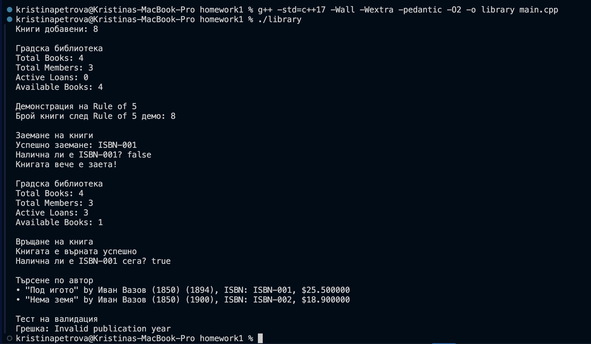

# Проект: Библиотечна система (Library System)

## Описание

Проектът **„Библиотечна система“** представлява малка C++ система, която моделира работата на библиотека чрез пет взаимосвързани класа — `Author`, `Book`, `Member`, `Loan` и `Library`.  
Той демонстрира прилагането на основни обектно-ориентирани концепции в C++:

- капсулация и достъп чрез getters и setters;
- конструктори, деструктори и правилото на 3/5 (Rule of 5);
- `const`-коректност и валидация на данни;
- статични членове и методи;
- работа със стандартни контейнери (`vector`);
- добри ООП практики в реалистичен контекст.

---

## Структура на проекта

```
homework1/
├── Author.h
├── Book.h
├── Member.h
├── Loan.h
├── Library.h
├── main.cpp
├── README.md
└── compile.sh
```

---

## Компилация и изпълнение

### Вариант 1: Използване на скрипт (Linux/macOS)
Отворете терминал в директорията `library-system/` и изпълнете:

```bash
chmod +x compile.sh
./compile.sh
```

### Вариант 2: Директна компилация
```bash
g++ -std=gnu++17 -Wall -Wextra -pedantic -O2 -o library main.cpp
```

След това стартирайте програмата:

```bash
./library
```

### За Windows с MinGW
```cmd
g++ -std=gnu++17 -Wall -Wextra -O2 -o library.exe main.cpp
library.exe
```

---

## Примерен изход

```
1. Създадени книги: 4

2. Информация за библиотеката:
Градска библиотека 'Иван Вазов'
Total Books: 4
Total Members: 3
Active Loans: 0
Available Books: 4

3. Демонстрация на Rule of 5:
   Брой книги преди: 4
   Брой книги след: 4

4. Заемане на книги:
   • ISBN-001 заета от M001
   Налична ли е ISBN-001? Не
   • ISBN-001 не може да се заеме (вече е заета)

5. Състояние след заеми:
Градска библиотека 'Иван Вазов'
Total Books: 4
Total Members: 3
Active Loans: 3
Available Books: 1

6. Връщане на книга:
   • ISBN-001 върната успешно
   Налична ли е ISBN-001 сега? Да

7. Търсене по автор 'Вазов':
   • "Под игото" by Иван Вазов (1850) (1894), ISBN: ISBN-001, $25.50
   • "Нема земя" by Иван Вазов (1850) (1900), ISBN: ISBN-002, $18.90

8. Тест за просрочване:
   Заем от 2025-10-01 до 2025-10-15
   Просрочен ли е на 2025-11-01? Да

9. Тест на валидацията:
   • Хваната грешка: ISBN cannot be empty
   • Хваната грешка: Book with this ISBN already exists

10. Крайна статистика:
Градска библиотека 'Иван Вазов'
Total Books: 4
Total Members: 3
Active Loans: 3
Available Books: 1
Общо книги в паметта: 4

```

---

## Класове

### Клас `Author`
Представя автор на книга.

**Членове:**
- `std::string name` — име на автора  
- `int birthYear` — година на раждане  

**Методи:**
- `Author(std::string n, int y)` — параметризиран конструктор със списък за инициализация  
- `setBirthYear(int y)` — задава година на раждане с валидация (1850-2025)  
- `to_string()` — връща текстово описание на обекта  
- Гетъри за достъп до всички членове

---

### Клас `Book`
Представя книга в библиотеката. Демонстрира **Rule of 5**.

**Членове:**
- `std::string title` — заглавие  
- `Author author` — автор  
- `int year` — година на издаване  
- `double price` — цена  
- `std::string isbn` — уникален идентификатор  
- `static int totalBooks` — брояч на всички живи обекти  

**Методи:**
- Конструктори (по подразбиране и параметризиран)
- Деструктор, копиращи и преместващи конструктори и оператори (Rule of 5)
- `setYear(int y)`, `setPrice(double p)`, `setISBN(std::string i)` — сетъри с валидация
- `to_string()` — текстово представяне на книгата
- `static getTotalBooks()` — връща броя на живите обекти

---

### Клас `Member`
Представя читател/член на библиотеката.

**Членове:**
- `std::string name` — име  
- `std::string memberId` — уникален идентификатор  
- `int yearJoined` — година на присъединяване  

**Методи:**
- `Member(std::string n, std::string id, int y)` — параметризиран конструктор
- `setMemberId(std::string id)`, `setYearJoined(int y)` — сетъри с валидация
- `to_string()` — текстово описание на член

---

### Клас `Loan`
Представя заем на книга от читател.

**Членове:**
- `std::string isbn` — ISBN на заетата книга  
- `std::string memberId` — ID на читателя  
- `std::string startDate`, `dueDate` — начална и крайна дата  
- `bool returned` — статус на заема  

**Методи:**
- `Loan(std::string i, std::string mid, std::string start, std::string due)` — конструктор с валидация
- `markReturned()` — маркира книгата като върната
- `isOverdue(const std::string& today)` — проверява дали заемът е просрочен
- `to_string()` — текстово представяне на заема

---

### Клас `Library`
Основен клас, управляващ цялата библиотечна система.

**Членове:**
- `std::string name` — име на библиотеката  
- `std::vector<Book> books` — списък с книги  
- `std::vector<Member> members` — списък с членове  
- `std::vector<Loan> loans` — списък със заеми  

**Методи:**
- `addBook(const Book& b)`, `addMember(const Member& m)` — добавяне на елементи
- `hasBook(const std::string& isbn)` — проверка за наличие на книга
- `isBookAvailable(const std::string& isbn)` — проверка дали книгата е налична
- `loanBook(...)`, `returnBook(...)` — управление на заеми
- `findByAuthor(const std::string& authorName)` — търсене на книги по автор
- `to_string()` — обобщена информация за библиотеката

---

## Демонстрирани концепции

### 1. Rule of 5 (Book клас)
- Деструктор
- Копиращ конструктор
- Преместващ конструктор
- Копиращ оператор за присвояване
- Преместващ оператор за присвояване

### 2. Статични членове
- `Book::totalBooks` — брои живите инстанции на класа
- `Book::getTotalBooks()` — статичен метод за достъп до брояча

### 3. Валидация на данни
- Година на раждане (1850-2025)
- Година на издаване (1800-2025)
- Неотрицателна цена
- Непразни ISBN и Member ID
- Валидни дати (dueDate ≥ startDate)

### 4. Const-коректност
- Всички getters са `const` методи
- Методи, които не променят обекта, са маркирани като `const`

### 5. Добри практики
- Използване на списъци за инициализация
- Правилна обработка на изключения
- Капсулация (всички членове са private)
- Преместваща семантика (`std::move`)

---

## Демонстрация



---

## Използвани технологии

- **Език:** C++17
- **Стандартна библиотека:** `<string>`, `<vector>`, `<stdexcept>`, `<utility>`, `<algorithm>`
- **Компилатор:** g++/clang++ със стандарт C++17
- **Параметри на компилация:** `-Wall -Wextra -pedantic -O2`

---

## Автор

**Име:** *Кристина Петрова*  
**Факултетен номер:** *22515*  
**Курс:** Обектно-ориентирано програмиране (C++)  
**Дата:** *01.12.25*# homework1
